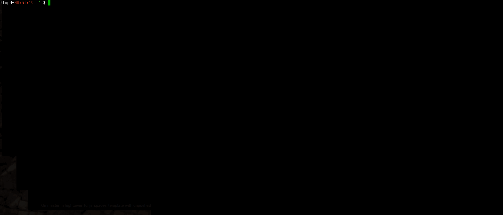

# ThreatConnect Angular Spaces App Template

PROJECT MOVED TO GITLAB: https://gitlab.com/fhightower-templates.

-----

**NOTE:** This app is **not** supported by ThreatConnect. While I'll attempt to keep it up to date and working well, please use at your own risk!

*Create a ThreatConnect spaces app in less than 30 seconds.*



## Usage

```
cookiecutter https://github.com/fhightower-templates/threatconnect-angular-spaces-template.git
```

## Prerequisites

1. cookiecutter (required)

You will need to install [cookiecutter](https://github.com/audreyr/cookiecutter). This can be as easy as `pip install cookiecutter`, but there are other options available in the [cookiecutter documentation](https://cookiecutter.readthedocs.io/en/latest/installation.html#install-cookiecutter).

2. bumpversion (optional)

[Bumpversion](https://pypi.python.org/pypi/bumpversion) is really handy for incrementing version numbers. This app template is designed to work with bumpversion so that the following commands will increment the version number of the app appropriately:

- `bumpversion patch`
- `bumpversion minor`
- `bumpversion major`

You can read more about bumpversion [here](https://github.com/peritus/bumpversion#bumpversion).

## Details

This app is based on the example app [here](https://github.com/ThreatConnect-Inc/TCX_-_ExampleContextApp).

Feel free to raise an [issue](https://github.com/fhightower-templates/threatconnect-angular-spaces-template/issues) if you find anything wrong or have a suggestion.

There is a similar version of this template to create spaces apps using Javascript here: [https://github.com/fhightower-templates/threatconnect-js-spaces-template](https://github.com/fhightower-templates/threatconnect-js-spaces-template).

## Directory Listing Overview

TCX_-_Interactive_Browse:
```bash
angular@dev:TCX_-_Interactive_Browse$ ls
e2e/           karma.conf.js  package.json        README.md      tslint.json
Gruntfile.js   Makefile       package-lock.json   src/
install.json   node_modules/  protractor.conf.js  tsconfig.json
```

TCX_-_Interactive_Browse/e2e:
```bash
angular@dev:TCX_-_Interactive_Browse/e2e$ cd e2e; ls
app.e2e-spec.ts  app.po.ts  tsconfig.e2e.json
```

TCX_-_Interactive_Browse/src:
```bash
angular@dev:TCX_-_Interactive_Browse/src$ cd src; ls
app/          favicon.ico  polyfills.ts  tsconfig.app.json
assets/       index.html   styles.less   tsconfig.spec.json
environments/ main.ts      test.ts       typings.d.ts
```

TCX_-_Interactive_Browse/app: *This is where your main app development occurs*
```bash
angular@dev:TCX_-_Interactive_Browse/app$ cd app; ls
app.component.css      app.component.ts       main.component.html
app.component.html     app.module.ts          main.component.ts
app.component.spec.ts  app-routing.module.ts
```

- **main.component.html**     (Spaces app main html page)
- **main.component.ts**       (Spaces app main typescript)
